<div align="center">

# 🚀 DarkWinzo

<p align="center">
  
</p>

<p align="center">
  <a href="https://github.com/DarkWinzo">
    
  </a>
  <a href="mailto:DarkWinzo2240@gmail.com">
    
  </a>
  <a href="https://linkedin.com/in/darkwinzo">
    
  </a>
  <a href="https://twitter.com/darkwinzo">
    
  </a>
</p>

<p align="center">
  
  
  
</p>

</div>

---

## 👨‍💻 About Me

```typescript
const darkwinzo = {
  name: "DarkWinzo",
  location: "Sri Lanka 🇱🇰",
  age: 19,
  role: "Full-Stack Developer & AI Enthusiast",
  education: "Mechatronics Engineering Student",
  
  currentFocus: [
    "🤖 Artificial Intelligence & Machine Learning",
    "🌐 Full-Stack Web Development",
    "📱 Mobile App Development",
    "🔧 IoT & Embedded Systems"
  ],
  
  languages: ["JavaScript", "Python", "TypeScript", "Java", "C++"],
  frameworks: ["React", "Node.js", "Express", "Django", "Flutter"],
  databases: ["MongoDB", "PostgreSQL", "MySQL", "Redis"],
  tools: ["Docker", "AWS", "Git", "Linux", "VS Code"],
  
  motto: "Building the future, one line of code at a time ✨"
};
```

---

## 🛠️ Tech Stack

<div align="center">

### Languages


### Frontend


### Backend


### Databases


### Cloud & DevOps


</div>

---

## 📊 GitHub Analytics

<div align="center">
  
  
</div>

<div align="center">
  
</div>

<div align="center">
  
</div>

---

## 🏆 GitHub Trophies

<div align="center">
  
</div>

---

## 🚀 Featured Projects

<div align="center">

<table>
<tr>
<td width="50%">

### 🤖 AI Neural Network Framework
[](https://github.com/DarkWinzo/neural-framework)

**Tech Stack:** Python, TensorFlow, NumPy  
**Features:** Custom neural network implementation with advanced optimization algorithms

</td>
<td width="50%">

### 🌐 Full-Stack E-Commerce Platform
[](https://github.com/DarkWinzo/ecommerce-platform)

**Tech Stack:** React, Node.js, MongoDB  
**Features:** Real-time inventory, payment integration, admin dashboard

</td>
</tr>
<tr>
<td width="50%">

### 📱 Cross-Platform Mobile App
[](https://github.com/DarkWinzo/mobile-app)

**Tech Stack:** Flutter, Firebase, Dart  
**Features:** Real-time messaging, cloud sync, offline support

</td>
<td width="50%">

### 🔧 IoT Monitoring System
[](https://github.com/DarkWinzo/iot-monitor)

**Tech Stack:** Arduino, Raspberry Pi, Python  
**Features:** Sensor data collection, real-time alerts, web dashboard

</td>
</tr>
</table>

</div>

---

## 📈 Contribution Graph

<div align="center">
  
</div>

<picture>
  <source media="(prefers-color-scheme: dark)" srcset="https://raw.githubusercontent.com/DarkWinzo/DarkWinzo/output/github-contribution-grid-snake-dark.svg">
  <source media="(prefers-color-scheme: light)" srcset="https://raw.githubusercontent.com/DarkWinzo/DarkWinzo/output/github-contribution-grid-snake.svg">
  
</picture>

---

## 🎯 Current Goals & Learning

```mermaid
graph TD
    A[🎯 2025 Goals] --> B[Master AI/ML]
    A --> C[Cloud Architecture]
    A --> D[Open Source Contributions]
    A --> E[Technical Writing]
    
    B --> B1[Deep Learning]
    B --> B2[Computer Vision]
    B --> B3[NLP]
    
    C --> C1[AWS Solutions Architect]
    C --> C2[Kubernetes]
    C --> C3[Microservices]
    
    D --> D1[100+ Contributions]
    D --> D2[Maintain 5+ Projects]
    
    E --> E1[Tech Blog]
    E --> E2[Documentation]
```

<div align="center">



</div>

---

## 🌟 Achievements & Certifications

<div align="center">

| 🏆 Achievement | 📅 Date | 🔗 Link |
|:---|:---:|:---:|
| AWS Certified Developer | 2024 | [View](https://aws.amazon.com/certification/) |
| Google Cloud Professional | 2024 | [View](https://cloud.google.com/certification) |
| MongoDB Certified Developer | 2023 | [View](https://university.mongodb.com/) |
| Hacktoberfest Contributor | 2023 | [View](https://hacktoberfest.com/) |

</div>

---

## 📺 Latest YouTube Videos

<!-- YOUTUBE:START -->
- [Building AI Applications with Python](https://youtube.com/watch?v=example1)
- [Full-Stack Development Best Practices](https://youtube.com/watch?v=example2)
- [IoT Projects for Beginners](https://youtube.com/watch?v=example3)
- [Machine Learning Fundamentals](https://youtube.com/watch?v=example4)
<!-- YOUTUBE:END -->

<div align="center">
  <a href="https://youtube.com/channel/UCvdAz2Ll-LedcDApJ2IGP6A?sub_confirmation=1">
    
  </a>
</div>

---

## 📝 Latest Blog Posts

<!-- BLOG-POST-LIST:START -->
- [The Future of AI in Web Development](https://blog.darkwinzo.dev/ai-web-development)
- [Building Scalable Microservices with Node.js](https://blog.darkwinzo.dev/microservices-nodejs)
- [IoT Security Best Practices](https://blog.darkwinzo.dev/iot-security)
- [Getting Started with Machine Learning](https://blog.darkwinzo.dev/ml-getting-started)
<!-- BLOG-POST-LIST:END -->

---

## 💬 Let's Connect!

<div align="center">

I'm always excited to collaborate on innovative projects and discuss the latest in technology! Whether you're interested in AI, web development, IoT, or just want to chat about tech, feel free to reach out.

### 🤝 Open to:
- 💼 **Freelance Projects** - Full-stack development, AI solutions
- 🎓 **Mentoring** - Helping newcomers in programming
- 🚀 **Collaborations** - Open source projects and research
- 💡 **Consulting** - Technical architecture and best practices

<p align="center">
  <a href="mailto:DarkWinzo2240@gmail.com">
    
  </a>
  <a href="https://linkedin.com/in/darkwinzo">
    
  </a>
  <a href="https://twitter.com/darkwinzo">
    
  </a>
  <a href="https://discord.gg/darkwinzo">
    
  </a>
</p>

</div>

---

## ☕ Support My Work

<div align="center">

If you find my projects helpful or interesting, consider supporting my work!

<p align="center">
  <a href="https://www.buymeacoffee.com/DarkWinzo">
    
  </a>
  <a href="https://github.com/sponsors/DarkWinzo">
    
  </a>
  <a href="https://patreon.com/DarkWinzo">
    
  </a>
</p>

</div>

---

<div align="center">
  
  
  <p>
    <strong>⭐ Star my repositories if you find them useful!</strong><br>
    <em>Made with ❤️ by DarkWinzo</em>
  </p>
  
  <p>
    
    
  </p>
</div>