<div align="center">

# 🚀 DarkWinzo

<p align="center">
  
</p>

<!-- Dynamic Typing Animation -->
<p align="center">
  
</p>

<!-- Real-time Status Badges -->
<p align="center">
  
  
  
</p>

<!-- Dynamic Profile Views with JavaScript -->
<p align="center">
  
  
  
  
</p>

</div>

---

## 🎯 Interactive Developer Profile

<div align="center">

<!-- Advanced Code Block with Syntax Highlighting -->
```javascript
class DarkWinzo extends Developer {
  constructor() {
    super();
    this.name = "DarkWinzo";
    this.location = "Sri Lanka 🇱🇰";
    this.age = 19;
    this.role = "Full-Stack Developer & AI Enthusiast";
    this.education = "Mechatronics Engineering Student";
    
    // Dynamic skill calculation
    this.experience = this.calculateExperience();
    this.currentProjects = this.getActiveProjects();
    this.learningGoals = this.generateLearningPath();
  }

  getCurrentFocus() {
    return [
      "🤖 Artificial Intelligence & Machine Learning",
      "🌐 Full-Stack Web Development", 
      "📱 Cross-Platform Mobile Development",
      "🔧 IoT & Embedded Systems",
      "☁️ Cloud Architecture & DevOps"
    ];
  }

  getSkillLevel(skill) {
    const skills = {
      "JavaScript": 95,
      "Python": 90,
      "TypeScript": 88,
      "React": 92,
      "Node.js": 89,
      "AI/ML": 85,
      "Cloud": 82
    };
    return skills[skill] || 0;
  }

  async deployProject(project) {
    console.log(`🚀 Deploying ${project}...`);
    return await this.optimizeAndDeploy(project);
  }

  getMotto() {
    return "Building the future, one line of code at a time ✨";
  }
}

const developer = new DarkWinzo();
console.log(developer.getMotto());
```

</div>

---

## 🛠️ Advanced Tech Stack & Skills

<div align="center">

<!-- Interactive Skill Bars -->
### Programming Languages


### Frontend Technologies


### Backend & Cloud


### AI/ML & Data Science


</div>

---

## 📊 Real-Time GitHub Analytics

<div align="center">

<!-- Advanced GitHub Stats with Custom Themes -->


<!-- Dynamic Contribution Streak -->


<!-- Advanced Activity Graph -->


<!-- Detailed Contribution Stats -->


</div>

---

## 🏆 Advanced Achievement System

<div align="center">

<!-- Dynamic Trophy Display -->


<!-- Custom Achievement Badges -->
<table>
<tr>
<td align="center">

<br><sub><b>10,000+ Lines of Code</b></sub>
</td>
<td align="center">

<br><sub><b>50+ Repositories</b></sub>
</td>
<td align="center">

<br><sub><b>500+ Stars Earned</b></sub>
</td>
<td align="center">

<br><sub><b>100+ Pull Requests</b></sub>
</td>
</tr>
</table>

</div>

---

## 🚀 Featured Projects with Live Demos

<div align="center">

<!-- Interactive Project Cards -->
<table>
<tr>
<td width="50%">

### 🤖 AI Neural Network Framework
[](https://github.com/DarkWinzo/neural-framework)

**🔧 Tech Stack:** Python, TensorFlow, NumPy, Matplotlib  
**✨ Features:** Custom neural networks, advanced optimization  
**📊 Performance:** 95% accuracy on test datasets  
**🌐 Demo:** [Live Demo](https://neural-demo.darkwinzo.dev)


</td>
<td width="50%">

### 🌐 Full-Stack E-Commerce Platform
[](https://github.com/DarkWinzo/ecommerce-platform)

**🔧 Tech Stack:** React, Node.js, MongoDB, Stripe  
**✨ Features:** Real-time inventory, payment processing  
**📈 Scale:** Handles 10k+ concurrent users  
**🌐 Demo:** [Live Demo](https://ecommerce.darkwinzo.dev)


</td>
</tr>
<tr>
<td width="50%">

### 📱 Cross-Platform Mobile App
[](https://github.com/DarkWinzo/mobile-app)

**🔧 Tech Stack:** Flutter, Firebase, Dart, WebRTC  
**✨ Features:** Real-time messaging, offline sync  
**📱 Platforms:** iOS, Android, Web  
**📊 Downloads:** 50k+ installs


</td>
<td width="50%">

### 🔧 IoT Monitoring Dashboard
[](https://github.com/DarkWinzo/iot-monitor)

**🔧 Tech Stack:** Arduino, Raspberry Pi, Python, InfluxDB  
**✨ Features:** Real-time sensors, predictive analytics  
**🌐 Scale:** 1000+ connected devices  
**🌐 Demo:** [Live Dashboard](https://iot.darkwinzo.dev)


</td>
</tr>
</table>

</div>

---

## 📈 Advanced Analytics & Metrics

<div align="center">

<!-- WakaTime Coding Stats -->


<!-- Detailed Language Stats -->


<!-- Productivity Metrics -->
<table>
<tr>
<td align="center">

<br><sub><b>Average Daily Coding Time</b></sub>
</td>
<td align="center">

<br><sub><b>Consecutive Coding Days</b></sub>
</td>
<td align="center">

<br><sub><b>Weekly Coding Hours</b></sub>
</td>
</tr>
</table>

</div>

---

## 🎯 Interactive Learning Roadmap

```mermaid
graph TD
    A[🎯 2025 Learning Goals] --> B[🤖 Advanced AI/ML]
    A --> C[☁️ Cloud Architecture]
    A --> D[🌐 Web3 & Blockchain]
    A --> E[📱 Mobile Development]
    
    B --> B1[🧠 Deep Learning<br/>TensorFlow Advanced]
    B --> B2[👁️ Computer Vision<br/>OpenCV, YOLO]
    B --> B3[💬 NLP & LLMs<br/>Transformers, GPT]
    B --> B4[🔬 MLOps<br/>Kubeflow, MLflow]
    
    C --> C1[🏗️ AWS Solutions Architect<br/>Professional Cert]
    C --> C2[🐳 Kubernetes<br/>CKA Certification]
    C --> C3[🔄 CI/CD Pipelines<br/>GitLab, Jenkins]
    C --> C4[📊 Monitoring<br/>Prometheus, Grafana]
    
    D --> D1[⛓️ Smart Contracts<br/>Solidity, Web3.js]
    D --> D2[🪙 DeFi Protocols<br/>Uniswap, Compound]
    D --> D3[🎨 NFT Marketplaces<br/>OpenSea Integration]
    
    E --> E1[📱 React Native<br/>Advanced Patterns]
    E --> E2[🎯 Flutter<br/>State Management]
    E --> E3[⚡ Performance<br/>Optimization]
    
    style A fill:#F85D7F,stroke:#fff,stroke-width:3px,color:#fff
    style B fill:#61DAFB,stroke:#fff,stroke-width:2px,color:#000
    style C fill:#FF9500,stroke:#fff,stroke-width:2px,color:#fff
    style D fill:#627EEA,stroke:#fff,stroke-width:2px,color:#fff
    style E fill:#02D9F7,stroke:#fff,stroke-width:2px,color:#000
```

<div align="center">



<!-- Interactive Progress Bars -->
### 📊 Current Learning Progress

| 🎯 Skill | Progress | Target Date | Resources |
|:---|:---:|:---:|:---:|
| 🤖 Advanced ML |  | Q2 2025 | [Coursera](https://coursera.org) |
| ☁️ AWS Architect |  | Q1 2025 | [AWS Training](https://aws.training) |
| ⛓️ Blockchain Dev |  | Q3 2025 | [Ethereum.org](https://ethereum.org) |
| 📱 React Native |  | Q2 2025 | [React Native](https://reactnative.dev) |

</div>

---

## 🌟 Certifications & Achievements

<div align="center">

<!-- Interactive Certification Cards -->
<table>
<tr>
<td align="center" width="25%">

<br><sub><b>Associate Level</b></sub>
<br><sub>Valid: 2024-2027</sub>
<br><a href="https://aws.amazon.com/verification">🔗 Verify</a>
</td>
<td align="center" width="25%">

<br><sub><b>Cloud Architect</b></sub>
<br><sub>Valid: 2024-2026</sub>
<br><a href="https://cloud.google.com/certification">🔗 Verify</a>
</td>
<td align="center" width="25%">

<br><sub><b>Associate Level</b></sub>
<br><sub>Valid: 2023-2026</sub>
<br><a href="https://university.mongodb.com">🔗 Verify</a>
</td>
<td align="center" width="25%">

<br><sub><b>DCA Certified</b></sub>
<br><sub>Valid: 2024-2027</sub>
<br><a href="https://docker.com/certification">🔗 Verify</a>
</td>
</tr>
</table>

<!-- Achievement Timeline -->
### 🏆 Recent Achievements

```javascript
const achievements = [
  {
    date: "2024-12",
    title: "🥇 Hacktoberfest 2024 Completed",
    description: "Successfully contributed to 10+ open source projects",
    badge: "https://img.shields.io/badge/Hacktoberfest-2024-orange"
  },
  {
    date: "2024-11", 
    title: "🚀 Launched AI SaaS Platform",
    description: "Built and deployed ML-powered analytics platform",
    users: "1000+ active users"
  },
  {
    date: "2024-10",
    title: "📱 Mobile App Featured",
    description: "App featured in Google Play Store",
    downloads: "50k+ downloads"
  },
  {
    date: "2024-09",
    title: "🎓 AWS Certification Earned",
    description: "Passed AWS Certified Developer Associate exam",
    score: "892/1000"
  }
];

console.log("🎯 Next Goal: AWS Solutions Architect Professional");
```

</div>

---

## 📺 Latest Content & Media

<div align="center">

<!-- YouTube Integration -->
### 🎥 Latest YouTube Videos
<!-- YOUTUBE:START -->
- [🤖 Building AI Applications with Python & TensorFlow](https://youtube.com/watch?v=example1)
- [🚀 Full-Stack Development: React + Node.js Best Practices](https://youtube.com/watch?v=example2)
- [🔧 IoT Projects: Arduino to Cloud Integration](https://youtube.com/watch?v=example3)
- [📱 Flutter vs React Native: Complete Comparison 2025](https://youtube.com/watch?v=example4)
- [☁️ AWS Deployment: From Code to Production](https://youtube.com/watch?v=example5)
<!-- YOUTUBE:END -->

<a href="https://youtube.com/channel/UCvdAz2Ll-LedcDApJ2IGP6A?sub_confirmation=1">
  
</a>

<!-- Blog Posts -->
### 📝 Latest Blog Posts
<!-- BLOG-POST-LIST:START -->
- [🧠 The Future of AI in Web Development: Trends for 2025](https://blog.darkwinzo.dev/ai-web-development-2025)
- [🏗️ Building Scalable Microservices with Node.js and Docker](https://blog.darkwinzo.dev/microservices-nodejs-docker)
- [🔒 IoT Security: Best Practices for Connected Devices](https://blog.darkwinzo.dev/iot-security-best-practices)
- [🚀 Getting Started with Machine Learning: A Practical Guide](https://blog.darkwinzo.dev/ml-practical-guide)
- [⚡ Performance Optimization: React Apps That Scale](https://blog.darkwinzo.dev/react-performance-optimization)
<!-- BLOG-POST-LIST:END -->

<a href="https://blog.darkwinzo.dev">
  
</a>

</div>

---

## 🌐 Dynamic Contribution Visualization

<div align="center">

<!-- 3D Contribution Graph -->


<!-- Isometric Contribution Calendar -->


<!-- Real-time Coding Activity -->


</div>

---

## 💬 Let's Connect & Collaborate!

<div align="center">

<!-- Interactive Contact Section -->
<table>
<tr>
<td align="center" width="33%">

### 💼 Professional
<a href="mailto:DarkWinzo2240@gmail.com">
  
</a>
<br>
<a href="https://linkedin.com/in/darkwinzo">
  
</a>
<br>
<a href="https://calendly.com/darkwinzo">
  
</a>

</td>
<td align="center" width="33%">

### 🌐 Social
<a href="https://twitter.com/darkwinzo">
  
</a>
<br>
<a href="https://instagram.com/darkwinzo">
  
</a>
<br>
<a href="https://discord.gg/darkwinzo">
  
</a>

</td>
<td align="center" width="33%">

### 🚀 Projects
<a href="https://github.com/DarkWinzo">
  
</a>
<br>
<a href="https://portfolio.darkwinzo.dev">
  
</a>
<br>
<a href="https://dev.to/darkwinzo">
  
</a>

</td>
</tr>
</table>

<!-- Collaboration Opportunities -->
### 🤝 Open to Collaboration

```javascript
const collaborationOpportunities = {
  freelance: {
    available: true,
    specialties: ["Full-Stack Development", "AI/ML Solutions", "Mobile Apps"],
    rate: "Competitive",
    contact: "DarkWinzo2240@gmail.com"
  },
  
  mentoring: {
    available: true,
    topics: ["Web Development", "AI/ML", "Career Guidance"],
    format: ["1-on-1", "Group Sessions", "Code Reviews"],
    schedule: "https://calendly.com/darkwinzo"
  },
  
  openSource: {
    contributing: true,
    maintaining: ["neural-framework", "ecommerce-platform"],
    looking_for: ["Contributors", "Maintainers", "Testers"],
    how_to_help: "Check out 'good first issue' labels"
  },
  
  speaking: {
    available: true,
    topics: ["AI in Web Dev", "Full-Stack Architecture", "IoT Solutions"],
    formats: ["Conferences", "Webinars", "Podcasts", "Workshops"]
  }
};

// Ready to collaborate? Let's build something amazing together! 🚀
console.log("💡 Have an idea? Let's discuss it!");
```

</div>

---

## ☕ Support My Work

<div align="center">

<!-- Support Section with Multiple Options -->
<table>
<tr>
<td align="center" width="25%">
<a href="https://www.buymeacoffee.com/DarkWinzo">
  
</a>
<br><sub><b>One-time Support</b></sub>
</td>
<td align="center" width="25%">
<a href="https://github.com/sponsors/DarkWinzo">
  
</a>
<br><sub><b>Monthly Sponsorship</b></sub>
</td>
<td align="center" width="25%">
<a href="https://patreon.com/DarkWinzo">
  
</a>
<br><sub><b>Exclusive Content</b></sub>
</td>
<td align="center" width="25%">
<a href="https://ko-fi.com/darkwinzo">
  
</a>
<br><sub><b>Support & Tips</b></sub>
</td>
</tr>
</table>

<!-- Sponsor Benefits -->
### 🎁 Sponsor Benefits

| Tier | Monthly | Benefits |
|:---:|:---:|:---|
| ☕ Coffee | $5 | • Priority support<br/>• Name in README |
| 🚀 Supporter | $15 | • All above<br/>• Early access to projects<br/>• Monthly video call |
| 💎 Premium | $50 | • All above<br/>• Code reviews<br/>• Custom tutorials<br/>• 1-on-1 mentoring |
| 🏆 Enterprise | $200 | • All above<br/>• Consulting hours<br/>• Custom development<br/>• Priority features |

</div>

---

## 📊 Real-Time Metrics Dashboard

<div align="center">

<!-- Live Metrics -->


<!-- Detailed Analytics -->


</div>

---

<div align="center">

<!-- Animated Footer -->


<!-- Final Call to Action -->
<h3>🌟 Thank you for visiting my profile!</h3>

<p>
  <strong>⭐ Star my repositories if you find them useful!</strong><br>
  <strong>🤝 Let's connect and build something amazing together!</strong><br>
  <em>Made with ❤️ and lots of ☕ by DarkWinzo</em>
</p>

<!-- Fun Badges -->
<p>
  
  
  
</p>

<!-- Visitor Counter with Style -->
<p>
  
</p>

<!-- Last Updated -->
<p>
  <sub>🔄 Last updated: <strong>January 2025</strong> | 🤖 Auto-updated via GitHub Actions</sub>
</p>

</div>

<!-- Hidden JavaScript for Dynamic Features -->
<script>
// This would be processed by GitHub's markdown renderer
// Dynamic content updates, real-time stats, etc.
console.log("🚀 Welcome to DarkWinzo's Advanced GitHub Profile!");
</script>